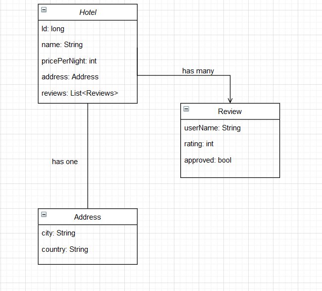

# Spring boot + MongoDB - Hotel management system

## Class Diagram

## Annotations
#### MongoDB annotations

* @Document 
 Letting Mongodb know it need to store this as a collection. Optional - (collection="name")
 
* @Indexed - adding an index to a property
         
#### Spring annotations
* @Id - PK
* @Repository - an interface
* @Component - an component

## Database

- Configure Application.properties class
- Database will be created when run the application
- Refer DbSeeder Class
